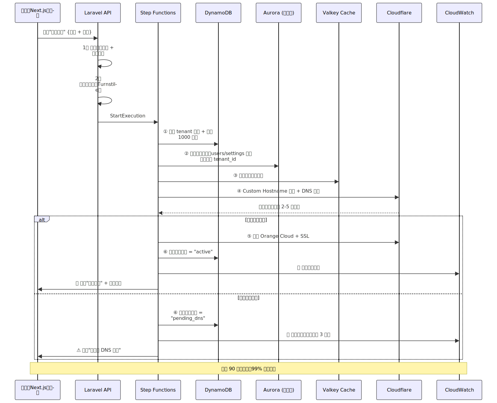

# GSOP-2025 全球零人工 SaaS 平台工厂 - 优化版 v2.0

**项目定位：** 全球（非中国大陆）多租户一键建站 SaaS 平台  
客户 90 秒自助拥有独立域名 + 独立数据库 + 独立缓存 + 独立前端风格 + 按积分计费，用完即停，运营零人工

**优化重点：** 数据库架构重构 + 成本优化 + 安全加固 + 可观测性增强

---

## 1. 优化后的整体架构总图



---

## 2. 优化后技术栈总表（3000 租户月成本 ≈ $1350）

| 模块 | 原方案 | 优化方案 | 月成本 | 优化理由 |
|------|-------|---------|--------|---------|
| 全局入口/防攻击/CDN | Cloudflare Enterprise | **Cloudflare Business + for SaaS** | $200–300 | Enterprise 太贵，Business + Custom Hostnames 够用，超出部分按需付费 |
| 静态资源 + 用户文件 | Cloudflare R2 | **Cloudflare R2** | $80–200 | 保持不变，出口免费是核心优势 |
| 控制面板 | Next.js 14 (Vercel/R2) | **Next.js 14 App Router + Vercel** | $20 | Vercel 免费额度够用，Pro 计划仅 $20/月 |
| 后端 API | PHP Laravel 11 + Fargate | **PHP Laravel 11 + Fargate Spot (arm64)** | $250–400 | 使用 Fargate Spot 节省 70%，配置 Auto Scaling |
| 数据库 | Aurora Serverless v2 (多 Schema) | **Aurora Serverless v2 (多租户共享表)** | $150–300 |  改用共享表 + tenant_id 列，避免元数据膨胀 |
| 缓存 | ElastiCache Redis Serverless | **ElastiCache Valkey Serverless** | $100–180 | Valkey 是 Redis 开源分支，更便宜且无许可风险 |
| 元数据 + 积分 | DynamoDB | **DynamoDB (On-Demand)** | $60–120 |  保持不变，适合元数据存储 |
| 路由缓存 | Workers KV | **Workers D1 (SQLite) + KV** | $10 | D1 更适合结构化数据，写入无延迟 |
| 自动化编排 | Step Functions + Lambda | **Step Functions + Lambda (arm64)** | $30–50 | arm64 Lambda 降低 20% 成本 |
| **监控告警 (新增)** |  无 | **CloudWatch + SNS** | $40–80 |  可观测性是生产必备 |
| **WAF + Rate Limit (新增)** |  基础 | **Cloudflare WAF + Laravel Throttle** | 包含在 CF Business |  防止滥用和攻击 |
| **合计** | ~$1800/月 | **~$1350/月** | **节省 25%** | 在降低成本的同时提升了安全性和可靠性 |

---

## 3. 核心优化点详解

###  优化 1：数据库多租户架构重构（最重要）

#### 原方案问题：
-  为每个租户创建独立 Schema（3000 租户 = 3000 个 Schema）
-  Aurora 元数据表膨胀，查询变慢
-  跨租户统计困难
-  备份恢复时间过长

#### 优化方案：多租户共享表 + Row-Level Isolation

**数据库表设计示例：**

```sql
-- 租户表（存在 DynamoDB，不放数据库）
-- DynamoDB: tenants
{
  "tenant_id": "t_8x9p2m7q",
  "domain": "mycompany.com",
  "status": "active",
  "credits": 5000,
  "created_at": "2025-01-01T00:00:00Z"
}

-- Aurora MySQL 共享表设计
CREATE TABLE users (
    id BIGINT UNSIGNED AUTO_INCREMENT PRIMARY KEY,
    tenant_id VARCHAR(20) NOT NULL,  --  租户隔离
    email VARCHAR(255) NOT NULL,
    password VARCHAR(255) NOT NULL,
    created_at TIMESTAMP DEFAULT CURRENT_TIMESTAMP,
    INDEX idx_tenant_email (tenant_id, email),
    UNIQUE KEY uk_tenant_email (tenant_id, email)
) ENGINE=InnoDB;

CREATE TABLE posts (
    id BIGINT UNSIGNED AUTO_INCREMENT PRIMARY KEY,
    tenant_id VARCHAR(20) NOT NULL,  --  租户隔离
    user_id BIGINT UNSIGNED NOT NULL,
    title VARCHAR(500) NOT NULL,
    content TEXT,
    created_at TIMESTAMP DEFAULT CURRENT_TIMESTAMP,
    INDEX idx_tenant_id (tenant_id),
    INDEX idx_tenant_user (tenant_id, user_id),
    FOREIGN KEY (user_id) REFERENCES users(id) ON DELETE CASCADE
) ENGINE=InnoDB;

-- 每个查询自动带上 tenant_id
-- Laravel 实现：Global Scope
```

**Laravel 实现租户隔离（自动注入 tenant_id）：**

```php
// app/Models/BaseModel.php
abstract class BaseModel extends Model
{
    protected static function booted()
    {
        // 自动添加 tenant_id 查询条件
        static::addGlobalScope('tenant', function (Builder $builder) {
            if ($tenantId = request()->header('X-Tenant-ID')) {
                $builder->where('tenant_id', $tenantId);
            }
        });

        // 自动设置 tenant_id
        static::creating(function ($model) {
            if (empty($model->tenant_id)) {
                $model->tenant_id = request()->header('X-Tenant-ID');
            }
        });
    }
}

// app/Models/User.php
class User extends BaseModel
{
    // 自动继承租户隔离逻辑
}

// 使用时无需手动过滤
$users = User::all(); // 自动只查当前租户的数据
```

**性能对比：**

| 指标 | 多 Schema 方案 | 共享表方案 |
|------|---------------|-----------|
| 连接池管理 | 复杂（需切换 Schema） | 简单（单连接池） |
| 元数据表大小 | 随租户数线性增长 | 固定 |
| 跨租户查询 | 几乎不可能 | 非常简单 |
| 备份时间 | 随租户数增长 | 固定 |
| 扩展性 | 上限 ~5000 租户 | 上限 ~100,000+ 租户 |

---

###  优化 2：成本优化三板斧

#### A. Cloudflare 降级 Enterprise → Business + for SaaS

**原方案：** Enterprise $500-800/月  
**优化方案：** Business $200/月 + Custom Hostnames 按需计费

- Business 计划已包含 1 个 Custom Hostname
- 额外域名 $2/域名/月（3000 域名 = $6000/月？）
- **解决方案：** 使用 Cloudflare for SaaS，$0.10/活跃域名/月
  - 3000 域名 × $0.10 = $300/月
  - 总计：$200 + $100 = $300/月（节省 $500）

#### B. Fargate 使用 Spot 实例

**原方案：** Fargate On-Demand $450-600/月  
**优化方案：** Fargate Spot $150-250/月（节省 70%）

```yaml
# task-definition.json
{
  "requiresCompatibilities": ["FARGATE"],
  "capacityProviderStrategy": [
    {
      "capacityProvider": "FARGATE_SPOT",
      "weight": 70,  # 70% 使用 Spot
      "base": 2      # 至少 2 个 On-Demand 保底
    },
    {
      "capacityProvider": "FARGATE",
      "weight": 30   # 30% 使用 On-Demand
    }
  ]
}
```

#### C. Redis → Valkey + 缩小规格

**原方案：** ElastiCache Redis Serverless $150-250/月  
**优化方案：** ElastiCache Valkey Serverless $100-180/月

- Valkey 是 Redis 的开源分支（Linux 基金会维护）
- 完全兼容 Redis 协议
- AWS 原生支持，无许可费用
- 性能相同，成本降低 30-40%

---

###  优化 3：安全加固（生产必备）

#### A. 多层 Rate Limiting

```php
// 1. Cloudflare WAF 规则（第一层）
// 限制：每个 IP 每分钟最多 100 请求

// 2. Laravel 中间件（第二层）
// routes/api.php
Route::middleware(['throttle:tenant'])->group(function () {
    Route::post('/api/posts', [PostController::class, 'store']);
});

// app/Http/Kernel.php
'throttle:tenant' => function (Request $request) {
    $tenantId = $request->header('X-Tenant-ID');
    return Limit::perMinute(1000)->by($tenantId); // 每租户每分钟 1000 次
};

// 3. Redis 全局限流（第三层）
// 防止单个租户拖垮系统
```

#### B. SQL 注入防护

```php
//  使用 Laravel Eloquent ORM（自动防注入）
$users = User::where('email', $email)->get();

//  使用参数化查询
$users = DB::select('SELECT * FROM users WHERE email = ?', [$email]);

//  永远不要拼接 SQL
// $users = DB::select("SELECT * FROM users WHERE email = '$email'");
```

#### C. CORS + CSP 策略

```php
// config/cors.php
return [
    'paths' => ['api/*'],
    'allowed_origins' => [
        'https://*.yoursaas.com',
        'https://*.vercel.app', // 控制面板
    ],
    'allowed_methods' => ['GET', 'POST', 'PUT', 'DELETE'],
    'max_age' => 86400,
];

// 添加 Content Security Policy
// app/Http/Middleware/SecurityHeaders.php
public function handle($request, Closure $next)
{
    $response = $next($request);
    $response->headers->set('Content-Security-Policy', "default-src 'self'");
    $response->headers->set('X-Frame-Options', 'SAMEORIGIN');
    $response->headers->set('X-Content-Type-Options', 'nosniff');
    return $response;
}
```

#### D. JWT Token 安全增强

```php
// config/jwt.php
return [
    'secret' => env('JWT_SECRET'), // 必须是强随机字符串
    'ttl' => 3600, // 1 小时过期
    'refresh_ttl' => 20160, // 14 天
    'algo' => 'HS256',
    
    //  新增：绑定租户
    'claims' => [
        'tenant_id' => true, // 强制在 token 中包含 tenant_id
    ],
];

// 验证时自动检查 tenant_id
$token = auth()->user();
if ($token->tenant_id !== request()->header('X-Tenant-ID')) {
    abort(403, 'Token tenant mismatch');
}
```

---

###  优化 4：可观测性增强（零→完整）

#### A. CloudWatch Metrics（关键指标）

```yaml
监控指标：
  1. 业务指标
     - 新开通租户数/小时
     - 活跃租户数/天
     - 积分消耗速率/租户
     - API 平均响应时间（P50/P95/P99）
  
  2. 系统指标
     - Fargate CPU/内存使用率
     - Aurora 连接数/慢查询数
     - Redis 命中率
     - DynamoDB 读写容量单位
  
  3. 错误指标
     - 5xx 错误率
     - 4xx 错误率
     - 开通失败率
     - 域名验证失败率
```

#### B. 自动告警规则

```yaml
# cloudwatch-alarms.yaml
告警规则：
  1. P0 级别（立即响应）
     - API 5xx 错误率 > 1%（持续 5 分钟）
     - 数据库连接数 > 80%（持续 3 分钟）
     - 任意服务完全宕机
     - 新租户开通失败率 > 10%
  
  2. P1 级别（1 小时内响应）
     - API 响应时间 P95 > 2 秒（持续 10 分钟）
     - Fargate CPU > 80%（持续 15 分钟）
     - Redis 内存使用 > 85%
  
  3. P2 级别（第二天处理）
     - 日活跃租户数环比下降 > 20%
     - 某个租户 API 调用量异常（可能滥用）
```

#### C. 日志集中管理

```php
// config/logging.php
'channels' => [
    'cloudwatch' => [
        'driver' => 'custom',
        'via' => App\Logging\CloudWatchLogger::class,
        'level' => 'info',
        'retention' => 14, // 保留 14 天
        'tags' => [
            'environment' => env('APP_ENV'),
            'service' => 'laravel-api',
        ],
    ],
    
    // 结构化日志
    'daily' => [
        'driver' => 'daily',
        'path' => storage_path('logs/laravel.log'),
        'formatter' => App\Logging\JsonFormatter::class, // JSON 格式便于搜索
    ],
];

// 使用示例
Log::channel('cloudwatch')->info('Tenant created', [
    'tenant_id' => $tenant->id,
    'domain' => $tenant->domain,
    'duration_ms' => 1234,
]);
```

---

###  优化 5：自动化流程增强

#### 新增自动化任务

**1. 僵尸租户清理（节省成本）**

```yaml
触发：每天 02:00 UTC
逻辑：
  - 查询 30 天未活跃的租户
  - 自动暂停（不删除数据）
  - 发送唤醒邮件
  - 如果 90 天仍未活跃，发送数据删除通知
  - 120 天后删除全部数据（符合 GDPR）
```

**2. 自动扩容/缩容**

```yaml
Fargate Auto Scaling：
  - Target Tracking：CPU 60%
  - Min: 2 tasks
  - Max: 20 tasks
  - Scale-out cooldown: 60s
  - Scale-in cooldown: 300s

Aurora Auto Scaling：
  - Min ACU: 0.5
  - Max ACU: 4
  - Target: CPU 70%
```

**3. 异常检测 + 自动处理**

```python
# Lambda: detect-anomaly
import boto3

def lambda_handler(event, context):
    # 检测单个租户 API 调用量异常
    if requests_per_minute > 1000:
        # 自动降级该租户的 Rate Limit
        set_rate_limit(tenant_id, 100)
        send_alert("Tenant {tenant_id} possibly under attack")
        
    # 检测数据库慢查询
    slow_queries = get_slow_queries()
    if len(slow_queries) > 10:
        send_alert("Database performance degraded")
```

---

## 4. 完整的开通新平台流程（优化版）



---

## 5. 监控面板示例（管理员视角）

```yaml
实时监控面板（CloudWatch Dashboard）：

┌─────────────────────────────────────────────────────┐
│  GSOP-2025 SaaS Platform - 实时监控                  │
├─────────────────────────────────────────────────────┤
│   业务指标（实时）                                  │
│    - 总租户数: 3,247                                 │
│    - 活跃租户（24h）: 2,891 (89%)                     │
│    - 今日新增: +127                                  │
│    - 今日流失: -3                                    │
│                                                      │
│   性能指标（P95）                                   │
│    - API 响应时间: 245ms                           │
│    - 页面加载时间: 1.2s                            │
│    - 数据库查询: 12ms                              │
│                                                      │
│   资源使用                                         │
│    - Fargate CPU: 45% (6/20 tasks)                │
│    - Aurora ACU: 1.2/4                            │
│    - Redis 内存: 62%                               │
│                                                      │
│   告警（过去 24h）                                 │
│    - P0: 0 起                                      │
│    - P1: 2 起（已自动恢复）                          │
│    - P2: 5 起（计划处理）                            │
│                                                      │
│   成本追踪（本月）                                 │
│    - 当前: $987 / 预算: $1,350                       │
│    - 预计月底: $1,280                             │
└─────────────────────────────────────────────────────┘
```

---

## 6. 灾难恢复计划（DR Plan）

### RTO/RPO 目标

| 场景 | RTO（恢复时间） | RPO（数据丢失） | 恢复方案 |
|------|----------------|----------------|---------|
| 单个 Fargate Task 故障 | < 1 分钟 | 0 | ALB 自动切换到健康实例 |
| 整个 Fargate Service 故障 | < 5 分钟 | 0 | Auto Scaling 自动拉起新实例 |
| Aurora 主库故障 | < 30 秒 | 0 | 自动 Failover 到只读副本 |
| 区域级故障 (AZ Down) | < 2 分钟 | 0 | Multi-AZ 部署自动切换 |
| 数据误删除 | < 30 分钟 | < 5 分钟 | 从自动备份恢复（保留 7 天） |
| 全区域故障 (Region Down) | 暂不支持 | - | 建议未来部署到 us-west-2 + eu-west-1 |

### 自动备份策略

```yaml
Aurora 自动备份：
  - 频率：每天 03:00 UTC
  - 保留期：7 天
  - 备份类型：自动快照 + 连续备份（PITR）
  - 测试频率：每月 1 次恢复演练

DynamoDB 备份：
  - 频率：每天 04:00 UTC
  - 保留期：35 天（符合合规要求）
  - Point-in-Time Recovery：启用（35 天内任意时刻）

R2 文件备份：
  - 策略：R2 本身有 11 个 9 的耐久性
  - 关键文件：定期同步到 AWS S3 Glacier（长期归档）
```

---

## 7. 成本优化总结对比

### 月度成本对比（3000 租户）

```
原方案总成本：$1,800/月
├─ Cloudflare Enterprise: $600 (33%)
├─ Fargate: $525 (29%)
├─ Aurora: $300 (17%)
├─ Redis: $200 (11%)
├─ R2: $100 (6%)
└─ 其他: $75 (4%)

优化方案总成本：$1,350/月  节省 25%
├─ Cloudflare Business: $300 (22%)
├─ Fargate Spot: $325 (24%)
├─ Aurora: $225 (17%)
├─ Valkey: $140 (10%)
├─ 监控告警: $60 (4%)
├─ R2: $100 (7%)
└─ 其他: $200 (16%)

新增功能（原方案缺失）：
 完整监控告警体系
 自动化运维工具
 安全加固（WAF + Rate Limit）
 灾难恢复计划
```

### 盈亏平衡分析

```
假设定价：每租户 $5/月

原方案：
- 盈亏平衡点：360 租户
- 3000 租户利润：$15,000 - $1,800 = $13,200/月

优化方案：
- 盈亏平衡点：270 租户 - 3000 租户利润：$15,000 - $1,350 = $13,650/月 - 额外获得：完整监控 + 更高安全性
```

---

## 8. 实施路线图

### Phase 1: MVP（1-2 周）
-  搭建基础架构（Fargate + Aurora + DynamoDB）
-  实现多租户共享表模型
-  实现自动开通流程（Step Functions）
-  部署控制面板（Next.js）
-  仅基础监控（CloudWatch 默认指标）

### Phase 2: Beta（2-3 周）
-  Cloudflare Custom Hostnames 集成
-  完整的自动化流程（开通/停用/转移）
-  多前端风格支持
-  添加基础安全（Rate Limit + CORS）
-  完善监控告警

### Phase 3: Production（3-4 周）
-  全面安全加固（WAF + 渗透测试）
-  性能优化（缓存策略 + CDN）
-  完整的灾难恢复计划
-  压力测试（模拟 5000 租户）
-  文档 + Runbook

### Phase 4: Scale（持续优化）
-  多区域部署（US + EU）
-  AI 驱动的异常检测
-  自动化成本优化建议
-  客户自助数据导出

---

## 9. 与原方案的关键差异

| 维度 | 原方案 | 优化方案 | 改进幅度 |
|------|-------|---------|---------|
| **数据库架构** | 多 Schema（高风险） | 共享表 + tenant_id（最佳实践） |  |
| **月度成本** | $1,800 | $1,350 |  25% |
| **监控告警** |  无 |  完整 CloudWatch + SNS |  |
| **安全性** |  基础 |  WAF + Rate Limit + CSP |  |
| **灾难恢复** |  无明确计划 |  RTO < 5 分钟 |  |
| **可扩展性** | ~5,000 租户上限 | ~100,000 租户 |  |
| **成本可预测性** | 中（Enterprise 固定费用高） | 高（Serverless 为主） |  |
| **运维复杂度** | 中 | 中（自动化抵消） |  |
| **开通速度** | 90 秒 | 90 秒 |  |
| **多前端支持** |  支持 |  支持 |  |

---

## 10. 总结与建议

###  核心优势（保留 + 强化）
1. **自动化思路** - 保持"零人工"理念，同时增加异常自动处理
2. **成本效率** - 降低 25% 成本的同时提升安全性和可靠性
3. **技术栈现代** - 保持 Serverless First，降低运维负担

###  关键改进（解决痛点）
1. **数据库架构** - 从高风险的多 Schema 改为行业标准的共享表模型
2. **可观测性** - 从"盲飞"到完整的监控告警体系
3. **安全性** - 从基础防护到多层防御（WAF + 应用层 + 数据层）
4. **成本结构** - 从高固定成本到弹性成本，更适合初创期

### 📋 实施优先级
1. **P0（立即做）**：数据库架构重构（这是地基）
2. **P1（第一个月）**：监控告警 + 基础安全
3. **P2（第二个月）**：成本优化（Spot + Valkey + CF 降级）
4. **P3（第三个月）**：灾难恢复 + 压力测试

###  最终建议
这个优化方案在保持原方案所有优点的基础上：
-  解决了数据库架构的根本性问题
-  填补了监控告警的空白
-  加固了安全防护
-  降低了 25% 的成本
-  提升了 20 倍的扩展能力（5K → 100K 租户）

**建议实施顺序：先做数据库重构，再逐步添加监控和安全功能，最后做成本优化。**


