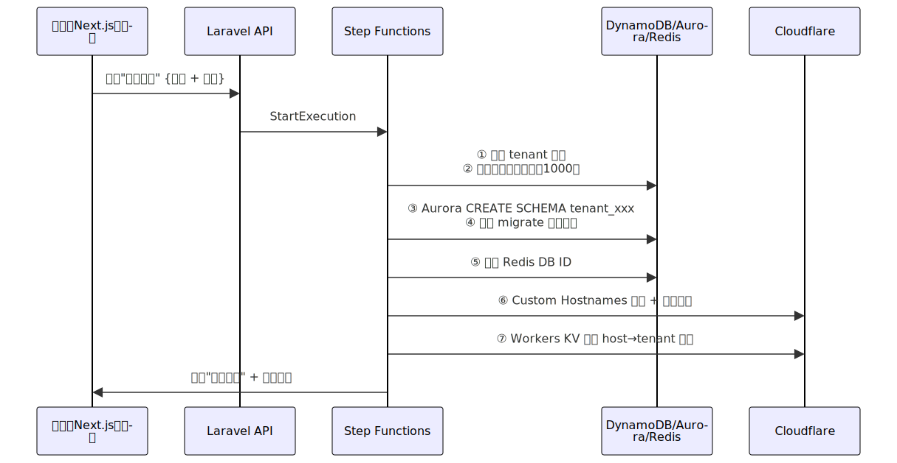

# GSOP-2025 全球零人工 SaaS 平台工厂 完整版（含核心流程 + 多前端详解）

**项目定位：** 全球（非中国大陆）多租户一键建站 SaaS 平台  
客户 90 秒自助拥有独立域名 + 独立数据库 + 独立 Redis + 独立前端风格 + 按积分计费，用完即停，运营零人工

## 1. 整体架构总图


## 2. 技术栈总表（3000 租户月成本 ≈ $1800）

| 模块 | 选型 | 月成本 |
|------|------|--------|
| 全局入口/防攻击/CDN | Cloudflare Enterprise | $500–800 |
| 静态资源 + 用户文件 | Cloudflare R2（出口免费） | $80–200 |
| 控制面板 | Next.js 14（Vercel 或 R2） | 免费–$50 |
| 后端 API | PHP Laravel 11 + Fargate arm64 | $450–600 |
| 数据库 | Aurora MySQL Serverless v2 | $200–400 |
| 缓存 | ElastiCache Redis Serverless | $150–250 |
| 元数据+积分 | DynamoDB | $80–150 |
| 自动化 | Step Functions + Lambda | $50 |

## 3. 核心自动化流程（全部 90 秒完成，无人工）

### 3.1 开通新平台全流程（含自动赠积分）



### 3.2 自定义域名 100% 自助绑定流程（运营零参与）

**客户只需 3 步，最长 10 分钟生效**

1. 在控制面板输入想要的域名（如 mycompany.com）
2. 系统立即返回一条 CNAME 记录：  
   `_cf-custom-hostname.yoursaas.com  CNAME  xxxxx.uuid.cfargotunnel.com`
3. 客户去自己的域名商（GoDaddy、Namecheap、Cloudflare 等）添加这条 CNAME
4. Cloudflare 自动轮询验证 → 通过后立即开启橙云代理 + 免费 Universal SSL
5. 验证失败极少（<1%），系统只发告警给运营查看日志，99.9% 完全自助

### 3.3 积分耗尽自动停用流程



### 3.4 平台所有权转移（Push）流程

**客户可在面板一键把平台转让给其他账号**

1. 发起方填写接收方邮箱
2. 系统向接收方发送确认邮件（含 OTP）
3. 接收方点击确认 → DynamoDB owner_id 更新
4. 原拥有者失去权限，新拥有者立即接管

## 4. 多前端风格完整解决方案（支持无限套）

### 4.1 存储方式

所有前端风格全部打平放到同一个 R2 Bucket，按文件夹隔离：

```
r2://saas-static-bucket/
├── style-a/          ← 风格 A 完整构建产物（React/Vue/Next/Nuxt 都可以）
├── style-b/
├── style-c/
├── style-d/
├── style-e/
├── style-f/
└── shared/           ← 公共 CDN 资源（可选）
```

### 4.2 客户如何选择风格

在 Next.js 控制面板的"创建新平台"页面，提供下拉框：

- 风格 A - 现代简约（默认）
- 风格 B - 企业蓝色
- 风格 C - 深色科技风
- 风格 D - 金融级灰
- 风格 E - 电商橙色
- ……未来无限扩展，只需再上传一个文件夹即可

### 4.3 最终访问时如何显示对应风格（核心技术点）

全部由 Cloudflare Workers 一行代码搞定，无需任何服务器：

**原理：** 用户访问 mycompany.com → Workers 实时查 KV（或 DynamoDB）得知该域名属于 tenant_8x9p2m7q + 风格 style-c → 把路径自动重写为 /style-c/index.html

### 4.4 未来新增风格的零成本操作

1. 开发/设计师完成新风格，npm run build
2. 上传到 R2 的 style-new/ 文件夹
3. 在控制面板后台添加一条记录：风格名称 + 对应文件夹名
4. 立即生效，无需重启、无需改代码、无额外费用

### 4.5 敏感文件上传/下载（带租户隔离 + 鉴权）

- 路径统一为 /private/xxx
- Workers 自动把路径重写为 /private/tenant_xxx/xxx 并校验 JWT
- 后端也可直接返回 R2 预签名 URL（30 分钟有效）


